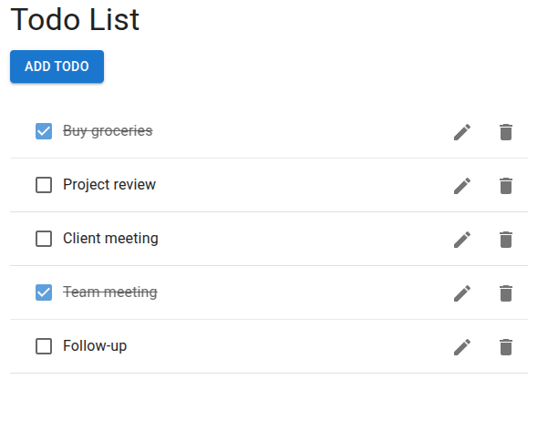
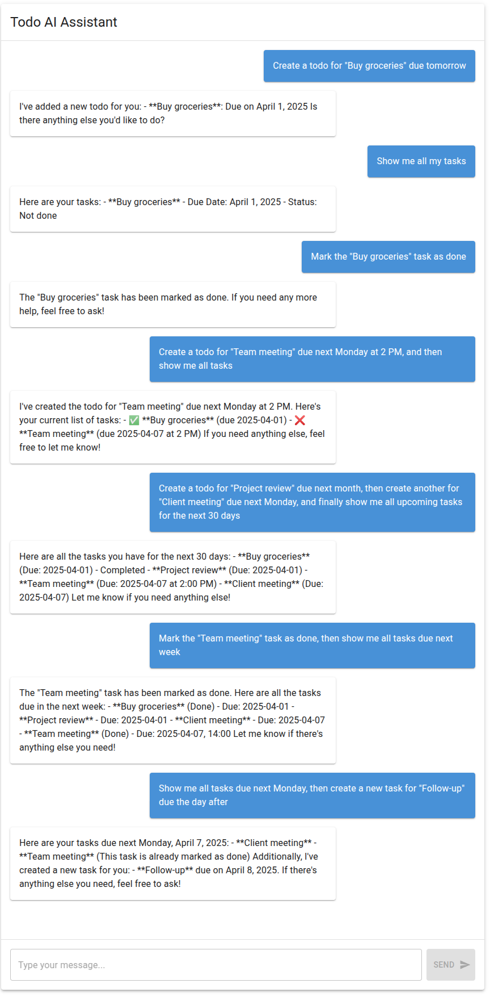

# TodoAI - A Modern Todo Application

A full-stack AI Todo application with natural language processing capabilities.

## Features

- Create, update, delete, and manage todos
- Natural language processing for task management
- AI-powered task scheduling and organization
- Real-time updates and notifications
- Modern and responsive UI

## Screenshots

### Todo Interface


### Chat Interface


## Getting Started

### Prerequisites
- Docker
- Docker Compose
- OpenAI API Key

### Running the Application

1. Clone the repository:
```bash
git clone https://github.com/YlmzCmlttn/ToDoAI.git
cd ToDoAI
```

2. Set up your OpenAI API key:
```bash
export OPENAI_API_KEY=your-api-key-here
```

3. Start the application using Docker Compose:
```bash
docker-compose up --build
```

4. Access the application:
- Frontend: http://localhost:3000
- Frontend AI Bot: http://localhost:3002
- Backend API: http://localhost:4000

## Example Prompts

### Regular Prompts (Single Function)

1. Create a todo:
```
Create a todo for "Buy groceries" due tomorrow
```

2. Show all tasks:
```
Show me all my tasks
```

3. Update a todo:
```
Mark the "Buy groceries" task as done
```

4. Delete a todo:
```
Delete the "Buy groceries" task
```

### Chain Function Calling Prompts (Multiple Functions)

1. Create and Show:
```
Create a todo for "Team meeting" due next Monday at 2 PM, and then show me all tasks
```

2. Complex Time-based Task:
```
Create a todo for "Project review" due next month, then create another for "Client meeting" due next Monday, and finally show me all upcoming tasks for the next 30 days
```

3. Update and Filter:
```
Mark the "Team meeting" task as done, then show me all tasks due next week
```

4. Delete and Verify:
```
Delete the "Project review" task and show me what's left
```

5. Complex Date-based Query:
```
Show me all tasks due next Monday, then create a new task for "Follow-up" due the day after
```
